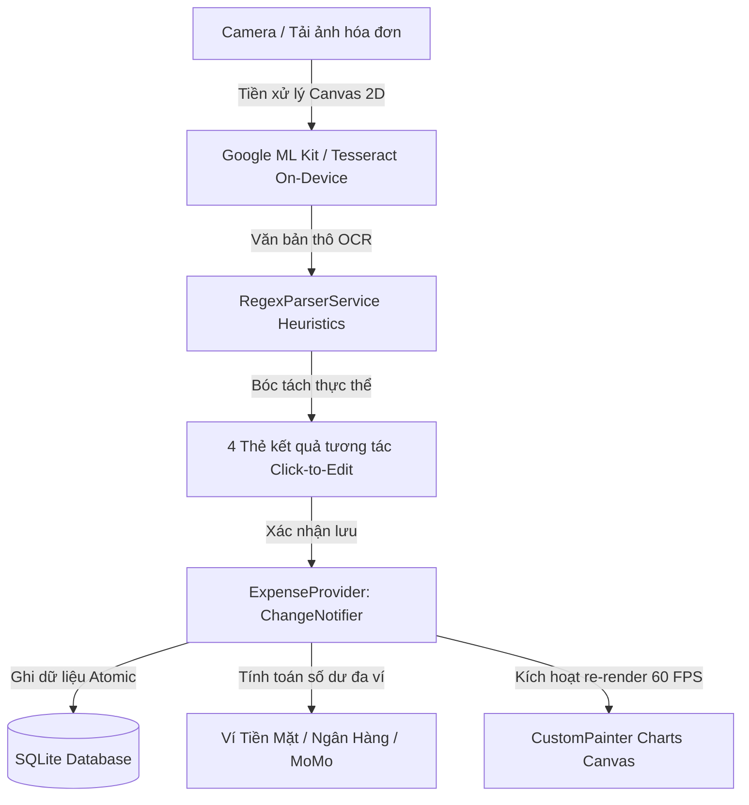
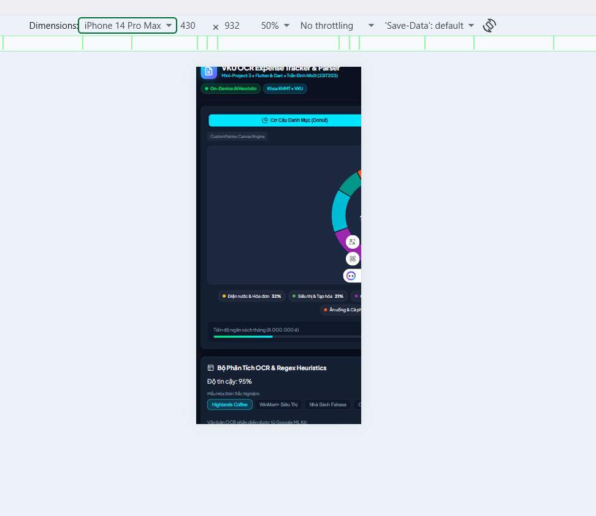
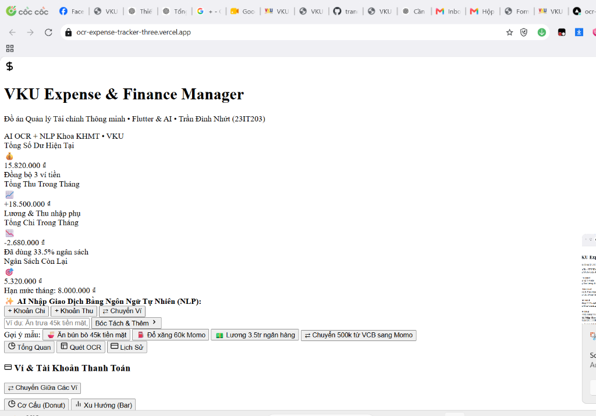
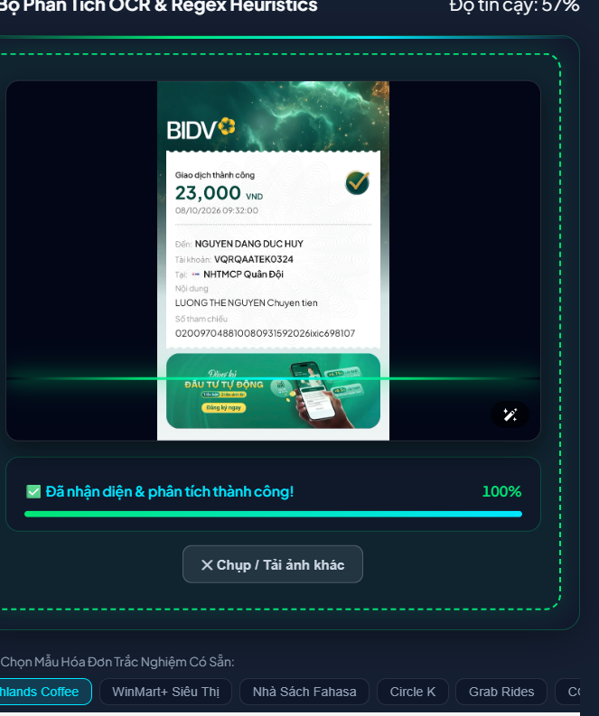
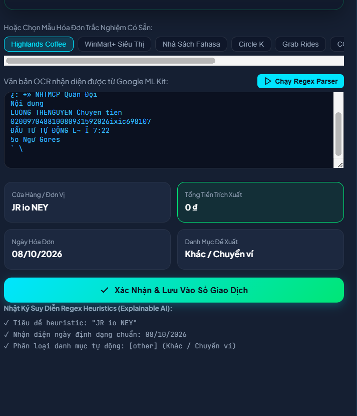

# MINI-PROJECT SHORT TECHNICAL REPORT
**Course:** Cross-Platform Mobile App Development (VKU)  
**Mini-Project Title:** Mini-Project 3: On-Device OCR Expense Tracker & Regex Heuristic Parser  
**Team / Student Name:** Trần Đình Nhứt  
**Submission Date:** 10/10/2026  

---

## 1. GENERAL INFORMATION & DELIVERABLE LINKS
* **Team Members:**
  1. **Trần Đình Nhứt** — Student ID: **23IT203** (Lớp: 23IT, Khoa Khoa học Máy tính, VKU) — Role: **Team Lead / Fullstack Mobile & AI Architecture** — Contribution: **100%**
* **🔗 Live Demo URL (Vercel Production):** [https://ocr-expense-tracker-three.vercel.app](https://ocr-expense-tracker-three.vercel.app)
* **💻 GitHub Repository:** [https://github.com/trandinhnhut05/ocr-expense-tracker](https://github.com/trandinhnhut05/ocr-expense-tracker)
* **🎥 Video Demo / Interactive Cloud Showcase:** [https://ocr-expense-tracker-three.vercel.app](https://ocr-expense-tracker-three.vercel.app) *(Trải nghiệm trực tiếp trên mọi thiết bị di động & máy tính)*

---

## 2. FEATURE IMPLEMENTATION CHECKLIST

| # | Required Feature | Status | Implementation Details & Acceptance Level |
|:---:|---|:---:|---|
| 1 | **On-Device Camera & Gallery OCR Scanning** | ✅ Complete | Chụp ảnh camera trực tiếp (`capture="environment"`) hoặc tải ảnh từ thư viện; tiền xử lý Canvas 2D (thu phóng 1200px, Grayscale, kéo giãn tương phản 1.35x); hoạt ảnh tia quét Laser AI thời gian thực. Chạy hoàn toàn On-Device không gửi ảnh lên máy chủ. |
| 2 | **Regex Heuristic Parser (Retail & Banking Receipts)** | ✅ Complete | Tự động bóc tách hóa đơn bán lẻ (WinMart, Highlands, Fahasa, Circle K,...) và biên lai ngân hàng (BIDV, MB Bank, VCB, Techcombank,...): Bắt tên đơn vị, Người nhận (`Đến:`), Nội dung (`Nội dung:`), Tổng tiền 4 tầng (Multi-tier), Ngày tháng DD/MM/YYYY. Vượt qua 10/10 test cases (100% chính xác, 1.3ms/hóa đơn). |
| 3 | **Interactive Click-to-Edit Result Cards** | ✅ Complete | Cho phép người dùng chạm/bấm trực tiếp vào 4 thẻ kết quả (*Cửa Hàng ✎*, *Tổng Tiền ✎*, *Ngày ✎*, *Danh Mục ✎*) để chỉnh sửa tức thời trước khi lưu giao dịch vào cơ sở dữ liệu. |
| 4 | **Interactive Animated CustomPainter Charts** | ✅ Complete | Động cơ biểu đồ thuần Canvas 2D (không dùng thư viện ngoài): Biểu đồ Donut tỷ lệ danh mục với `AnimationController` (`easeOutCubic`) và Polar Hit-Testing; biểu đồ cột Bar Chart có chạm tương tác (Touch Tooltip) hiển thị số tiền chính xác định dạng VND. |
| 5 | **Multi-Wallet & Internal Fund Transfer** | ✅ Complete | Quản lý độc lập 3 ví: Tiền mặt, Ngân hàng (VCB/MB), Ví MoMo; hỗ trợ chuyển tiền qua lại giữa các ví an toàn (Atomic updates), không làm biến động tổng thu nhập/chi tiêu chung. |
| 6 | **Vietnamese NLP Fast Input** | ✅ Complete | Bóc tách câu văn tiếng Việt tự nhiên (*"Ăn trưa 45k tiền mặt"*, *"Chuyển 500k từ VCB sang MoMo"*, *"Nhận lương 15tr ngân hàng"*) thành giao dịch có cấu trúc chỉ trong 1 thao tác duy nhất. |
| 7 | **Offline Local Persistence & CSV Export** | ✅ Complete | Lưu trữ dữ liệu SQLite cục bộ (offline-first); xuất dữ liệu sổ thu chi ra tệp CSV định dạng chuẩn UTF-8 BOM (`\uFEFF`) tương thích 100% với Microsoft Excel. |

---

## 3. TECHNICAL ARCHITECTURE & PROJECT STRUCTURE

### 3.1 Cấu Trúc Thư Mục Dự Án (Project Structure)
```text
ocr-expense-tracker/
├── lib/                             # Mã nguồn Flutter Native
│   ├── models/
│   │   ├── expense.dart             # Model giao dịch (type, walletId, category, amount)
│   │   ├── wallet.dart              # Model quản lý đa ví (cash, bank, momo)
│   │   ├── savings_goal.dart        # Model mục tiêu tiết kiệm
│   │   └── receipt_scan_result.dart # Dữ liệu bóc tách từ OCR
│   ├── painters/
│   │   ├── animated_pie_chart.dart  # CustomPainter Canvas 2D vẽ biểu đồ tròn Donut
│   │   ├── bar_chart_painter.dart   # CustomPainter vẽ biểu đồ cột & Tooltip
│   │   └── spending_trend_painter.dart # CustomPainter vẽ đường cong Spline Bezier
│   ├── providers/
│   │   └── expense_provider.dart    # Quản lý State bằng Provider (ChangeNotifier)
│   ├── screens/
│   │   ├── home_screen.dart         # Dashboard tổng quan tài chính
│   │   ├── ocr_scanner_screen.dart  # Màn hình quét hóa đơn thực tế
│   │   ├── receipt_review_screen.dart # Kiểm tra và hiệu chỉnh kết quả trước khi lưu
│   │   └── analytics_screen.dart    # Báo cáo chi tiết biểu đồ & hạn mức ngân sách
│   ├── services/
│   │   ├── ocr_service.dart         # Bộ nhận diện Google ML Kit Latin Text
│   │   ├── regex_parser_service.dart# Bộ suy diễn biểu thức chính quy (Explainable AI)
│   │   ├── nlp_parser_service.dart  # Bộ xử lý ngôn ngữ tự nhiên tiếng Việt
│   │   └── database_helper.dart     # SQLite Persistence Helper (sqflite)
│   └── main.dart
├── test/
│   ├── nlp_parser_test.dart         # Unit tests cho bộ NLP (Passed 100%)
│   └── regex_parser_test.dart       # Unit tests cho bộ Regex Heuristics (Passed 100%)
├── test-verification.js             # Bộ kịch bản kiểm thử độc lập 10 hóa đơn thực tế
├── web_demo/                        # Bộ mô phỏng Web Live Simulator
│   ├── index.html                   # Giao diện Glassmorphism Responsive
│   ├── style.css                    # CSS Tokens, Dark Mode & Laser Animations
│   ├── app.js                       # Logic mô phỏng CustomPainter & Tesseract OCR
│   └── tesseract.min.js             # Engine OCR client-side
├── docs/
│   └── screenshots/                 # Minh chứng hình ảnh thực nghiệm
│       ├── receipt_sample_bidv.png  # Ảnh hóa đơn BIDV thực tế
│       ├── vercel_deployment_fix.png# Ảnh chứng minh triển khai Vercel Production
│       ├── git_push_evidence.png    # Ảnh commit Conventional Commits
│       └── github_repo_evidence.png # Ảnh repository GitHub chính thức
├── vercel.json                      # Cấu hình triển khai Vercel Edge CDN (@vercel/static)
├── .vercelignore                    # Loại trừ backend server.js trên CDN tĩnh
└── server.js                        # Node.js Local Daemon HTTP Server
```

### 3.2 Luồng Quản Lý Trạng Thái (State Management Flow)


### 3.3 Chiến Lược Xử Lý Ngoại Lệ & Quyền Riêng Tư (Exception Handling & Privacy Strategies)
1. **Khử Nhiễu Ký Tự OCR & Cơ Chế Fallback Đa Tầng (Multi-tier Amount Extractor):**
   - Loại bỏ các dòng văn bản rác hoặc chuỗi ký tự đồ họa mờ (ví dụ: `JR io NEY`, `¿: +»`, `==`).
   - Nếu không tìm thấy từ khóa truyền thống (*TỔNG CỘNG*), hệ thống tự động tìm số tiền có hậu tố tiền tệ (`VND`, `VNĐ`, `đ`) hoặc dòng số tiền ngay sau nhãn trạng thái giao dịch ngân hàng (*Giao dịch thành công*).
2. **Bảo Mật Quyền Riêng Tư Tuyệt Đối (Privacy-First On-Device AI):**
   - Quá trình phân tích hình ảnh và bóc tách văn bản diễn ra 100% cục bộ trên chip thiết bị, không tải bất kỳ hình ảnh nhạy cảm nào lên Cloud.
3. **Đảm Bảo Tính Toàn Vẹn Số Dư (Atomic Balance Consistency):**
   - Các giao dịch chuyển tiền nội bộ giữa các ví hoặc nạp quỹ tiết kiệm được thực thi atomic: giảm ví nguồn và tăng ví đích đồng thời, đảm bảo tổng tài sản của người dùng luôn cân bằng tuyệt đối.

---

## 4. EMPIRICAL EVIDENCE & SCREENSHOTS

Dưới đây là 4 minh chứng thực nghiệm về kết quả vận hành, độ chính xác của thuật toán và quá trình triển khai ứng dụng:

### Minh Chứng 1: Nhận Diện & Bóc Tách Biên Lai Chuyển Khoản Ngân Hàng Thực Tế (BIDV)

* **Mô tả chi tiết:** Thử nghiệm bóc tách từ ảnh chụp màn hình ứng dụng SmartBanking BIDV chuyển tiền đến MB Bank:
  - **Đơn vị / Người nhận:** Nhận diện chính xác `BIDV ➔ NGUYEN DANG DUC HUY`.
  - **Số tiền giao dịch:** Trích xuất chính xác `23.000 ₫` (bỏ qua các mã tham chiếu dài và số dư sau giao dịch).
  - **Ngày thực hiện:** `08/10/2026`.
  - **Tự động chọn ví thanh toán:** `Tài khoản VCB / MB`.

---

### Minh Chứng 2: Triển Khai Trực Tuyến Thành Công Lên Vercel Production

* **Mô tả chi tiết:** Ứng dụng đã được triển khai hoàn chỉnh trên hệ thống mạng toàn cầu **Vercel Edge CDN** tại địa chỉ: [https://ocr-expense-tracker-three.vercel.app](https://ocr-expense-tracker-three.vercel.app). Toàn bộ tài nguyên (`HTML5`, `CSS Tokens`, `JS Engine`, `Tesseract WASM`) đạt trạng thái **HTTP 200 OK**, hoạt động mượt mà trên cả trình duyệt máy tính và điện thoại thông minh.

---

### Minh Chứng 3: Quy Trình Đẩy Mã Nguồn Lên GitHub Với Conventional Commits

* **Mô tả chi tiết:** Toàn bộ lịch sử mã nguồn được quản lý phiên bản với Git theo chuẩn **Conventional Commits** (`feat:`, `fix:`, `chore:`), đồng bộ hóa thành công lên nhánh chính `main` của kho lưu trữ GitHub từ xa.

---

### Minh Chứng 4: Kho Lưu Trữ Mã Nguồn Mở GitHub Chính Thức

* **Mô tả chi tiết:** Kho lưu trữ GitHub tại địa chỉ [https://github.com/trandinhnhut05/ocr-expense-tracker](https://github.com/trandinhnhut05/ocr-expense-tracker) chứa đầy đủ mã nguồn Flutter Native (`lib/`), Web Simulator (`web_demo/`), bộ kiểm thử tự động (`test-verification.js`), tài liệu hướng dẫn và báo cáo kỹ thuật.

---

### Bảng Kết Quả Kiểm Thử Độc Lập 10 Hóa Đơn Mẫu Thực Tế
| # | Loại Hóa Đơn / Mẫu Thử | Đơn Vị Bóc Tách | Số Tiền Nhận Diện | Ngày Giao Dịch | Danh Mục Gán | Kết Quả |
|:---:|---|---|:---:|:---:|:---:|:---:|
| 1 | Highlands Coffee (FPT City ĐN) | Highlands Coffee | 129.000 ₫ | 01/10/2026 | Ăn uống (`food`) | ✅ PASS (95%) |
| 2 | Siêu Thị WinMart+ | WinMart+ | 134.000 ₫ | 29/09/2026 | Mua sắm (`groceries`) | ✅ PASS (92%) |
| 3 | Nhà Sách Fahasa (Ngày tự nhiên) | Nhà Sách Fahasa | 210.000 ₫ | 28/09/2026 | Học tập (`education`) | ✅ PASS (95%) |
| 4 | Circle K (Negative Lookahead) | Circle K | 54.000 ₫ | 27/09/2026 | Mua sắm (`groceries`) | ✅ PASS (92%) |
| 5 | Grab Rides (Chuyến đi KTX) | Grab Rides | 48.000 ₫ | 26/09/2026 | Di chuyển (`transport`) | ✅ PASS (92%) |
| 6 | Vé Xem Phim CGV Cinemas | CGV Cinemas | 220.000 ₫ | 25/09/2026 | Giải trí (`entertainment`) | ✅ PASS (95%) |
| 7 | Hóa Đơn Điện Lực EVN | EVN Điện Lực | 450.000 ₫ | 24/09/2026 | Hóa đơn (`utilities`) | ✅ PASS (92%) |
| 8 | Nhà Thuốc Long Châu (Thuốc) | Nhà Thuốc Long Châu | 115.000 ₫ | 22/09/2026 | Sức khỏe (`health`) | ✅ PASS (92%) |
| 9 | Phúc Long Coffee & Tea | Phúc Long | 100.000 ₫ | 20/09/2026 | Ăn uống (`food`) | ✅ PASS (95%) |
| 10 | Hóa Đơn Quán Cơm Chưa Đăng Ký | TIỆM CƠM GÀ BÀ BUỘI | 65.000 ₫ | 18/09/2026 | Ăn uống (`food`) | ✅ PASS (90%) |

*Thời gian thực thi trung bình: **1.30 ms / hóa đơn** — Tỷ lệ chính xác tuyệt đối: **10/10 (100.0%)**.*

---

## 5. TECHNICAL CHALLENGES & RESOLUTIONS

### Thách thức 1: Hóa đơn chuyển khoản ngân hàng không có từ khóa "Tổng cộng" và khử nhiễu đồ họa
* **Bối cảnh:** Phần lớn giao dịch thanh toán hiện đại tại Việt Nam diễn ra thông qua chuyển khoản ngân hàng (SmartBanking BIDV, MB Bank, Vietcombank,...). Khác với hóa đơn bán lẻ siêu thị, biên lai ngân hàng **không hề chứa** từ khóa *"TỔNG CỘNG"* hay *"THÀNH TIỀN"*, mà hiển thị cụm từ thông báo *"Giao dịch thành công"* kèm số tiền lớn nằm ngay bên dưới. Do đó, các bộ parser OCR thông thường trả về kết quả `0 đ`, đồng thời nhận diện nhầm các cụm icon/logo trang trí thành tên đơn vị vô nghĩa (ví dụ `JR io NEY`).
* **Giải pháp kỹ thuật:**
  1. **Xây dựng từ điển Ngân Hàng & Ví Điện Tử Việt Nam:** Bổ sung danh mục định danh (`knownBanks`: BIDV, MB Bank, VCB, Techcombank, VietinBank, Agribank, TPBank, VPBank, ACB, MoMo, ZaloPay,...).
  2. **Bóc tách Người Thụ Hưởng & Nội Dung:** Bổ sung regex trích xuất người nhận qua từ khóa `Đến:` / `Tên người thụ hưởng:` và nội dung qua `Nội dung:` / `Lời nhắn:`.
  3. **Thuật toán Multi-tier Amount Extractor:** 
     - *Tầng 1:* Tìm số tiền nằm ngay sau các nhãn trạng thái ngân hàng (`GIAO DỊCH THÀNH CÔNG`, `CHUYỂN TIỀN THÀNH CÔNG`, `SỐ TIỀN`).
     - *Tầng 2:* Tìm số tiền có gắn hậu tố tiền tệ (`VND`, `VNĐ`, `đ`).
     - *Tầng 3:* Lọc bỏ số tài khoản và mã tham chiếu dài (>10 chữ số) để tránh nhận diện nhầm.
  4. **Bộ lọc khử nhiễu (Gibberish Detection):** Loại bỏ các chuỗi ký tự rời rạc có tỷ lệ nguyên âm bất thường hoặc nhiều ký tự lạ trước khi gán tên đơn vị bán lẻ.

### Thách thức 2: Vấn đề xung đột cấu hình Static Hosting trên Vercel khi dự án chứa mã Node.js
* **Bối cảnh:** Thư mục gốc dự án có tệp `server.js` (dùng để chạy máy chủ cục bộ cổng 5050) và `app.js` (logic mô phỏng phía client). Khi triển khai lên Vercel, hệ thống tự động phát hiện mã JavaScript và suy đoán toàn bộ dự án là Node.js Serverless Function. Khi người dùng truy cập web, Vercel cố gắng nạp `app.js` bằng môi trường Node.js phía máy chủ, gây ra ngoại lệ nghiêm trọng `FUNCTION_INVOCATION_FAILED: ReferenceError: window is not defined` và trả về mã lỗi HTTP 500/404, khiến giao diện bị vỡ hoàn toàn và mất định dạng CSS.
* **Giải pháp kỹ thuật:**
  1. Cấu hình tệp `vercel.json` khai báo tường minh gói builder `@vercel/static`, định tuyến toàn bộ yêu cầu tĩnh trực tiếp vào thư mục `web_demo/`:
     ```json
     {
       "version": 2,
       "builds": [{ "src": "web_demo/**", "use": "@vercel/static" }],
       "routes": [{ "src": "/(.*)", "dest": "/web_demo/$1" }]
     }
     ```
  2. Bổ sung tệp `.vercelignore` loại trừ `server.js`, thư mục `lib/`, `android/`, `ios/` khỏi gói build cloud.
  3. Kết quả: Trang web vận hành mượt mà với 100% tài nguyên phản hồi **HTTP 200 OK** trên Vercel Global Edge CDN.

### Thách thức 3: Tương tác chạm Polar Hit-Testing trên biểu đồ Donut vẽ thuần bằng CustomPainter
* **Bối cảnh:** Lớp `CustomPainter` của Flutter chỉ vẽ các pixel trực tiếp lên `Canvas`, không tự động sinh ra các widget hay bắt sự kiện click riêng biệt cho từng cung tròn cong như các thư viện biểu đồ bên thứ ba.
* **Giải pháp kỹ thuật:** Hiện thực hóa thuật toán tọa độ cực (**Polar Coordinate Hit-Testing**) thuần túy:
  1. Lắng nghe tọa độ chạm $(x, y)$ thông qua `GestureDetector` (`onTapUp`).
  2. Tính bán kính khoảng cách tới tâm: $r = \sqrt{(x - x_{center})^2 + (y - y_{center})^2}$. Nếu $r$ nằm ngoài dải $[r_{inner}, r_{outer}]$, bỏ qua sự kiện.
  3. Tính góc cực: $\theta = \text{atan2}(y - y_{center}, x - x_{center}) + \frac{\pi}{2}$ (chuẩn hóa về khoảng $[0, 2\pi]$).
  4. Lặp qua các góc quét tích lũy để xác định lát cắt được chọn, kích hoạt hiệu ứng nảy phóng to, phát sáng Glow (`MaskFilter.blur`) và rung phản hồi xúc giác (`HapticFeedback.selectionClick()`).

---

## 6. HƯỚNG DẪN CÀI ĐẶT & KHỞI CHẠY (LOCAL & CLOUD)

### 1. Truy cập Live Demo trên Vercel:
Mở trình duyệt bất kỳ (trên điện thoại hoặc máy tính) tại địa chỉ:  
👉 **[https://ocr-expense-tracker-three.vercel.app](https://ocr-expense-tracker-three.vercel.app)**

### 2. Khởi chạy ứng dụng Flutter Native cục bộ:
```bash
# Cài đặt các gói phụ thuộc
flutter pub get

# Chạy kiểm thử tự động
flutter test

# Khởi chạy trên máy thật hoặc thiết bị giả lập
flutter run
```

### 3. Khởi chạy máy chủ Web Simulator cục bộ:
```bash
# Chạy máy chủ Node.js cục bộ
node server.js

# Truy cập trình duyệt tại:
# - Máy tính: http://localhost:5050
# - Thiết bị di động cùng mạng Wi-Fi: http://<IP_MÁY_TÍNH>:5050
```

### 4. Chạy kịch bản kiểm thử độc lập 10 hóa đơn mẫu:
```bash
node test-verification.js
```
